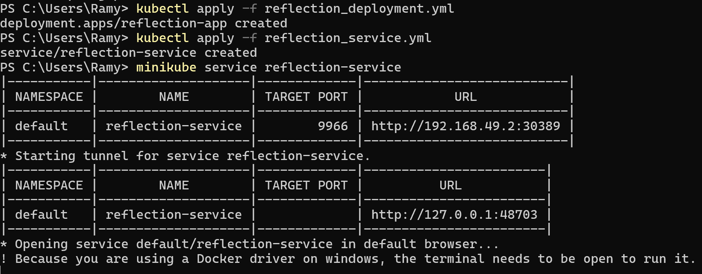

# Refleksi 1

1. Sebelum diekspos sebagai Service, log hanya mencatat akses lokal. Setelah jadi Service, log mencatat akses dari IP cluster. Setiap kali aplikasi dibuka lewat proxy, log bertambah. Ini menandakan akses berhasil diteruskan oleh Service. Jumlah log naik tiap kali app diakses. Service bekerja sesuai fungsinya.

2. Opsi -n digunakan untuk menentukan namespace. Tanpa -n, kubectl get hanya menampilkan resource di namespace default. Namespace memisahkan resource agar tidak tercampur. Bagian kube-system berisi komponen internal Kubernetes. Resource yang dibuat ada di namespace lain. Misalnya, default.

# Refleksi 2

1. Strategi Rolling Update memperbarui pod secara bertahap.Pod baru dibuat dulu sebelum pod lama dihapus. Aplikasi tetap tersedia selama proses update. Strategi Recreate menghapus semua pod lama sekaligus. Lalu pod baru dibuat setelahnya. Recreate bisa menyebabkan downtime sementara.

2.  Kita perlu melakukan beberapa Langkah untuk dapat menerapkan Recreate deployment. Pertama, siapkan file reflection_deployment.yml. Lalu, siapkan juga reflection_service.yml. Kedua, jalankan kubectl apply -f reflection_deployment.yml untuk membuat deployment. Terakhir, coba akses dengan minikube service. Hasil dapat dilihat pada tangkapan layar.

3. File reflection_deployment.yml digunakan untuk membuat deployment aplikasi. Strateginya diset ke Recreate agar pod lama dihapus sebelum pod baru dibuat. Deployment ini hanya menjalankan satu replika dari container. Container menggunakan image spring-petclinic-rest dan port 9966. File reflection_service.yml membuat service agar aplikasi bisa diakses. Service menggunakan tipe NodePort dan mengarah ke port 9966.

4. Manifest file membuat proses deployment lebih cepat. Semua konfigurasi disimpan dalam satu file. Cukup sekali apply, semua resource langsung dibuat. Lebih efisien dibandingkan perintah manual. Dapat mengurangi tingkat kesalahan karena tidak ketik ulang. Mudah untuk didistribusikan.
